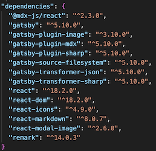
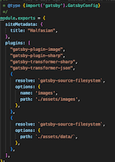

# HALFASIAN

This is a website for a Visual Art Project, Halfasian. This site is a static site to showcase their ongoing project.
##PROJECT ON LIVE
[HALFASIAN}(https://halfasiansmain.gatsbyjs.io/)

## 🚀MOTIVATION

The aim of this website is to create a website to showcase the ongoing collaborative works by Halfasian.

## 🚀ABOUT

- This website was developed with Gatsby version 5.10.0
- At this stage there is no database attached to this site
- In order to start local server, run `npm run develop` in the terminal
  the site is viewable in the browser localhost:8000 and GraphiQL is accessible localhost.8000/\_\_\_graphql
- some of the data are stored in json files
- To access the data, enqury through graphQL, GraphiQL is a tool to access the required data
- Several plugins have been installed, for the list see the list in the image
- 
- These plugins are necessary for rendering images dynamically and for modal images - to install these run command npm install -plugin-name in the terminal
- In order to make query through Postgraph these are necessary configurations
- 
- CSS is used for the styling of the site and there are several `module.css` files attached to js filles.

## 🚀FUTURE FEATURE

- additional of sound to the website
- changing the json file to MDX file for data storage
- Redeploy with unique domain name
- Currently modal images function with a lightbox plugin which gives a clean aethetics but is not quite coherent to the rest of the site. This can change in the future
- add small interactivity in the second page, at the moment it is text heavy.
